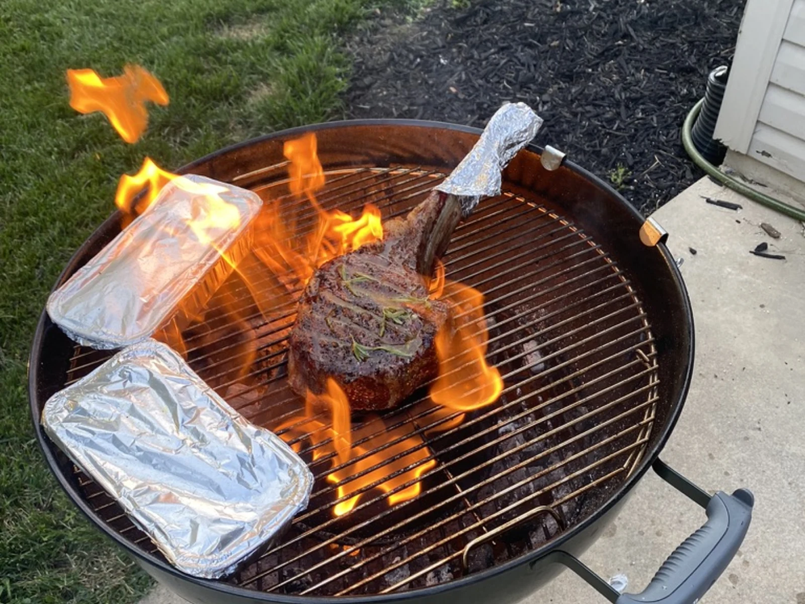

+++
date = 2026-09-02
title = "Cooking Is a Series of Rabbit Holes"
description = "Steaks, sourdough, Chinese takeout standards, and the things I am still trying to get right."
tags = ["cooking", "food", "grilling", "baking", "Chinese food"]
feature = "tomahawk-over-flame.webp"
featureAlt = "A tomahawk steak getting a hard sear over open flame."
draft = false
+++

I almost went to cooking school when I got out of high school. I did not go, but cooking has always been around in one form or another. I grew up in the Midwest, where grilling was just part of life. My dad grilled when I was a kid, and I started doing it young too.

During the pandemic, I had more time to cook for myself and my son. That was when I started treating it less like dinner and more like something worth learning. I began looking up recipes, paying attention to techniques, and trying things that felt a little beyond my usual rotation. My son has since grown up and moved out, and now it is mostly me and my girlfriend. She is a very encouraging audience, which has probably made all of this worse in the best way.

<!--more-->

## Fire has always been there

Steaks are where I hold myself to the highest standard. I have tried sous vide followed by the grill, sous vide followed by a skillet, and the oven with a reverse sear. Lately, my favorite method is the Rec Teq Bullseye. I smoke the steak until it is around 115 to 120 degrees, then sear it as hard as I can.

The part with the flames is deliberate. I use butter, rosemary, garlic, and a little beef tallow to finish it. I have opinions about steak, and I am comfortable saying that I am probably harder on my own than anybody else is.



Grilling has also made me more willing to try things I would have skipped before. Shrimp, eggplant, smash burgers, whatever sounds good. Most people can make a decent steak. The fun part is learning how heat changes everything else.

## Low and slow is its own kind of problem

Smoking asks for a different kind of attention. There is more waiting, more checking, and a lot more time to second-guess whether the bark, temperature, and timing are all headed in the right direction. That is exactly the kind of thing I tend to get interested in.



## Chinese food is the current rabbit hole

My girlfriend and I both love Chinese food, which has made it a fun and frustrating thing to learn at home. I want a stir-fry to be quick, but I also want it to have that takeout-style flavor and texture that is hard to explain until you get it right.

Learning how to velvet beef and chicken was a turning point. I had made plenty of stir-fries where the meat was fine, but never as tender or flavorful as what I wanted. [*The Woks of Life*](https://www.penguinrandomhouse.com/books/671310/the-woks-of-life-by-judy-bill-sarah-and-kaitlin-leung/) helped me understand the method and the reason behind it. Now I can make a good stir-fry without it becoming a whole project.



There are still plenty of things I am working on. Eggplant is newer for me. I had barely cooked with it before, and now I want to figure out how to make it worth putting on the grill or in a wok.

Of course, not every experiment works. I tried a Thai recipe with ground beef, vegetables, and a lot of spice. I forgot to thaw the beef, put it in frozen, and learned again why that is a bad idea. It released a bunch of water and basically boiled. The texture was terrible. I could not eat it. My girlfriend ate it anyway because she hates wasting food, so it was not a total loss.

## Bread was a new frontier

I got into bread around 2022. Grilling had always been familiar, but baking felt like a different kind of problem. I had eaten plenty of homemade bread that was dense or just not quite right, and I wondered if I could make the kind I actually wanted to eat.

I started with sourdough, bought Ken Forkish's [*Flour Water Salt Yeast*](https://www.penguinrandomhouse.com/books/216098/flour-water-salt-yeast-by-ken-forkish/), and started learning the process. Then I got curious about soft mall pretzels. I love them, so I wanted to see whether I could make an Auntie Anne's-style version at home. Turns out I could. Every person who has tried them has said they are good, which is nice. I am still the one trying to make the next batch better.

Making hoagie rolls was another one of those questions that turned into a project. Once the bread was good enough that I wanted to build a sandwich around it, I knew I had gone down another rabbit hole.



I do want people to enjoy the food I make. I cook for my girlfriend, my son when he is around, and anybody else who happens to be there. But I am usually cooking for myself first. If I take a bite and think, "This is amazing," I feel good about the whole thing. Sometimes I will pick apart something that I know could have been better while my girlfriend is telling me it is great. She is usually more generous than I am.

That is probably why I keep bouncing around. I do not need one specialty. I just like finding something I want to eat, getting curious about how it works, and chasing it until I make a version I am proud of.
